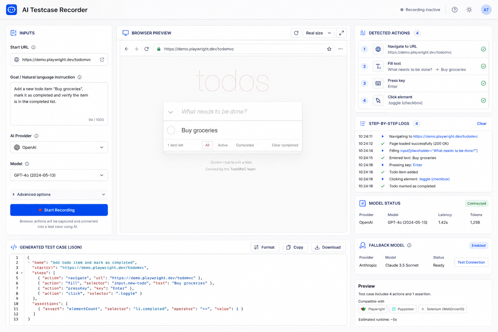

# AI Testcase Recorder

AI Testcase Recorder is a small Playwright + AI automation project that records browser actions for a natural-language goal and saves the result as a reusable JSON test case.

The recorder:

- opens a real browser with Playwright
- inspects the current page DOM
- asks an AI model for the next best action
- executes the action
- stores the recorded steps in `output/test-case.json`

You can then replay the saved test case with the playback script in `tests/playback.ts`.
You can also launch a local GUI to configure runs, watch live logs, preview the browser, and inspect the generated JSON output.

## Demo

### GUI Preview


## What This Project Does

Give the recorder:

- a starting URL
- a goal written in plain English

Example:

```json
{
  "startUrl": "https://www.google.com",
  "goal": "Search for Playwright and click on the official website"
}
```

The recorder will try to complete the goal step by step and save the actions it performed.

## Current Project Structure

```text
AI-Testcase-Recorder/
|-- artifacts/
|-- config/
|   |-- record-config.example.json
|-- output/
|   |-- test-case.json
|-- public/
|   |-- app.js
|   |-- index.html
|   `-- styles.css
|-- src/
|   |-- ai/
|   |   |-- AIAgent.ts
|   |-- core/
|   |   |-- BrowserManager.ts
|   |   |-- Recorder.ts
|   |   `-- RecordingRunner.ts
|   |-- utils/
|   |   |-- domUtils.ts
|   |   |-- types.ts
|   |-- record.ts
|   `-- server.ts
|-- tests/
|   `-- playback.ts
|-- .env
|-- .gitignore
|-- package-lock.json
|-- package.json
|-- README.md
`-- tsconfig.json
```

## Main Files

- `src/record.ts`: main recording entry point
- `src/server.ts`: local GUI server for browser-based recording control
- `src/ai/AIAgent.ts`: asks the model for the next browser action
- `src/core/BrowserManager.ts`: launches Playwright and executes actions
- `src/core/Recorder.ts`: saves recorded steps into `output/test-case.json`
- `src/core/RecordingRunner.ts`: shared recording runner used by both CLI and GUI flows
- `src/utils/domUtils.ts`: extracts interactive DOM data for the AI
- `src/utils/types.ts`: shared TypeScript types
- `tests/playback.ts`: replays the saved test case

## Requirements

- Node.js
- npm
- Google Chrome installed locally, or a Playwright-compatible browser setup
- an API key for your chosen AI provider

## Installation

```bash
npm install
```

## Environment Setup

Create a `.env` file in the project root.

Example:

```env
AI_API_KEY=your_key_here
AI_MODEL=openai/gpt-4.1-mini
AI_FALLBACK_MODELS=openai/gpt-4o-mini,openai/gpt-4.1-nano
AI_BASE_URL=https://openrouter.ai/api/v1
AI_PROVIDER=OpenRouter
MAX_AI_STEPS=20
PLAYWRIGHT_CHANNEL=chrome
```

Optional environment variables:

- `AI_API_KEY`: preferred generic API key variable for any OpenAI-compatible provider
- `OPENROUTER_API_KEY`: legacy fallback for OpenRouter setups
- `OPENAI_API_KEY`: fallback for direct OpenAI usage
- `AI_MODEL`: primary model used for planning
- `AI_FALLBACK_MODELS`: comma-separated fallback models to try if the first one fails
- `AI_FALLBACK_MODEL`: legacy single fallback model
- `AI_BASE_URL`: custom OpenAI-compatible endpoint
- `AI_PROVIDER`: optional label used in logs
- `MAX_AI_STEPS`: max number of AI-driven steps per recording
- `PLAYWRIGHT_CHANNEL`: browser channel to launch
- `PLAYWRIGHT_EXECUTABLE_PATH`: explicit browser executable path

Notes:

- If `AI_BASE_URL` is omitted and `OPENAI_API_KEY` is set, the app uses the default OpenAI endpoint.
- If `AI_BASE_URL` is omitted and `OPENROUTER_API_KEY` is set, the app defaults to `https://openrouter.ai/api/v1`.
- The recorder is now plug-and-play for OpenAI-compatible providers. To switch models, update `AI_MODEL` or the `ai.model` field in your record config.

## Config File

The preferred config file location is:

```text
config/record-config.json
```

You can create it from:

```text
config/record-config.example.json
```

Example:

```json
{
  "startUrl": "https://www.google.com",
  "goal": "Search for Playwright and click on the official website",
  "ai": {
    "provider": "OpenRouter",
    "model": "openai/gpt-4.1-mini",
    "fallbackModels": [
      "openai/gpt-4o-mini"
    ],
    "baseUrl": "https://openrouter.ai/api/v1"
  }
}
```

The optional `ai` block lets you override the provider label, model, fallback models, and base URL for one recording run without editing `.env`.

## Usage

### 1. Record a test case

Using the default config file:

```bash
npm run record
```

Using a specific JSON config file:

```bash
npm run record -- config/record-config.json
```

Using CLI arguments directly:

```bash
npm run record -- https://example.com "Open login page and fill the form"
```

Recorded output is saved to:

```text
output/test-case.json
```

### 2. Launch the GUI

```bash
npm run gui
```

Then open:

```text
http://localhost:3000
```

The GUI lets you:

- enter the start URL and goal
- choose provider, model, and fallback models
- watch live recorder logs
- view the latest browser preview snapshot
- inspect the generated JSON test case

### 3. Replay the recorded test case

```bash
npm run playback
```

Playback reads:

```text
output/test-case.json
```

## Artifacts

Failure screenshots are stored in:

```text
artifacts/
```

These are useful when a step fails and you want to see the page state at that moment.

## Available Scripts

```bash
npm run check
npm run gui
npm run record
npm run playback
```

- `npm run check`: run the TypeScript type check
- `npm run gui`: start the local browser-based recorder interface
- `npm run record`: start AI-based recording
- `npm run playback`: replay the saved test case

## How Recording Works

1. `record.ts` loads a start URL and goal.
2. Playwright opens a browser page.
3. `domUtils.ts` extracts visible interactive elements.
4. `AIAgent.ts` sends the page state and recent history to the AI model.
5. The model returns exactly one next action.
6. `BrowserManager.ts` executes that action.
7. `Recorder.ts` appends the step to the JSON output file.
8. The loop continues until the goal is reached or the step limit is hit.

## Output Format

The generated test case contains:

- test name
- ordered steps
- selector metadata
- URL metadata
- optional failure information

The saved file is JSON so it can be inspected, edited, or reused later.

## Notes

- New recordings are written to `output/test-case.json`.
- Playback is treated as a test helper, so it lives under `tests/`.
- The recorder currently relies on DOM-guided AI planning rather than screenshot-based vision control.
- Some websites with aggressive bot protection, CAPTCHA, OTP, or highly dynamic UIs may still fail.
